# dwizzyWEEB Runtime Map

This file documents how the app currently moves data through UI sections, search, local persistence, Zustand, and internal API routes.

## Architecture Snapshot

- The app now uses a layered runtime:
  - `src/lib/media.ts` for source fetch contracts
  - `src/lib/enrichment.ts` for metadata enrichment
  - `src/lib/adapters/*` for domain orchestration
- Most route pages still split into `page.tsx` and `*PageClient.tsx`.
- `src/app/api/*` exists for selected server adapters and cacheable search endpoints.
- Personalization is local-first through `localStorage`.
- UI interaction state is centralized in Zustand.

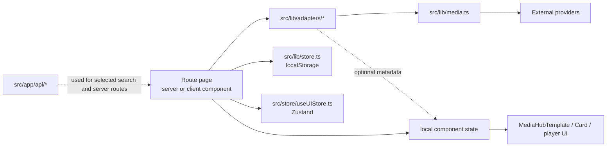

## App Shell And Shared UI

Primary shell lives in `src/app/layout.tsx`.

- `DeviceListener`
- `Navbar`
- route content
- `PWAInstallPrompt`
- `LiveActivityToast`
- `MobileNav`
- `Footer`

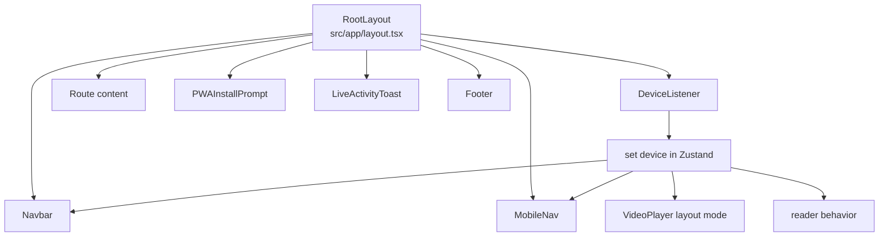

## UI Sections

### Home Page Sections

Home page lives in `src/app/page.tsx`.

- `HeroCarousel`
- `ContinueWatching`
- `SavedContentSection`
- ordered domain sections via `HomeContentSection`

The order of content sections is not static. It is derived from `dwizzy_interests` in `localStorage`.

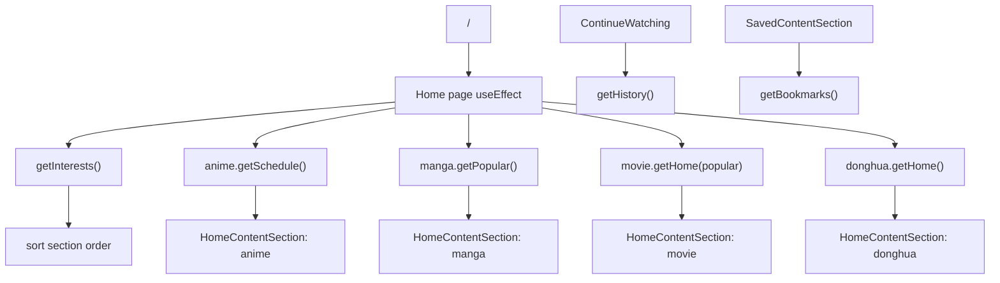

### Shared Hub Layout

Hub pages reuse `src/components/organisms/MediaHubTemplate.tsx`.

- `MediaHubHeader`
- optional `GenreFilter`
- optional `extraFilters`
- conditional state:
  - loading skeletons
  - filtered results grid
  - default page children

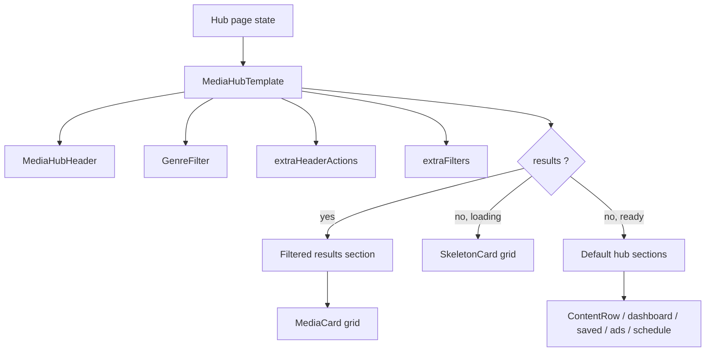

### Route-Level UI Inventory

```mermaid
flowchart TD
  A["Home"] --> A1["HeroCarousel"]
  A --> A2["ContinueWatching"]
  A --> A3["SavedContentSection"]
  A --> A4["HomeContentSection x4"]

  B["Anime Hub"] --> B1["AnimeDashboard"]
  B --> B2["SavedContentSection"]
  B --> B3["ReleaseCalendar"]
  B --> B4["Infinite ongoing grid"]

  C["Manga Hub"] --> C1["Trending Manga row"]
  C --> C2["SavedContentSection"]
  C --> C3["New Releases grid"]

  D["Movie Hub"] --> D1["Most Popular row"]
  D --> D2["SavedContentSection"]
  D --> D3["Latest Releases grid"]

  E["Donghua Hub"] --> E1["Latest Updates row"]
  E --> E2["SavedContentSection"]
  E --> E3["Ongoing Cultivators grid"]
```

## Search Modal

Global search lives in `src/components/organisms/SearchModal.tsx`.

- controlled by Zustand `isSearchOpen`
- triggered by navbar button or `Cmd/Ctrl + K`
- fans out to manga, anime, donghua, and movie search in parallel
- movie poster enrichment happens after initial render
- route navigation uses `router.push`

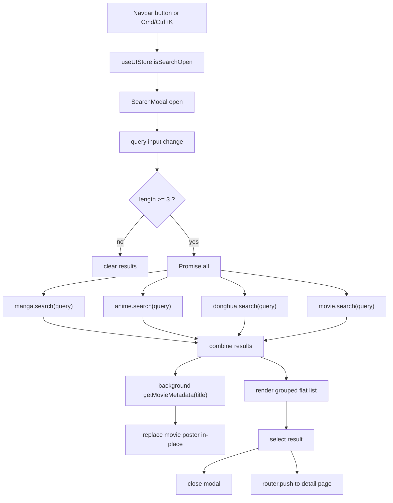

## Local Storage

Persistence lives in `src/lib/store.ts`.

### Keys

- `dwizzy_history`
- `dwizzy_bookmarks`
- `dwizzy_interests`
- `dwizzy_dead_mirrors`
- `dwizzy_preferred_mirror`

### Responsibilities

- history for continue-watching / continue-reading
- bookmarks for saved sections
- interests for section ordering and lightweight personalization
- dead mirrors for stream source filtering
- preferred mirror for player source stickiness

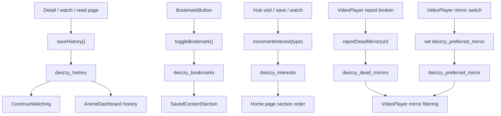

## Zustand

Global UI state lives in `src/store/useUIStore.ts`.

### State

- `device`
- `isSidebarOpen`
- `isSearchOpen`
- `isTheaterMode`
- `isLightsDimmed`
- `readerWidth`

### Usage

- `DeviceListener` sets `device`
- `Navbar` and `MobileNav` branch on device
- `SearchModal` uses `isSearchOpen`
- `VideoPlayer` uses theater and lights state
- manga chapter reader uses `readerWidth`

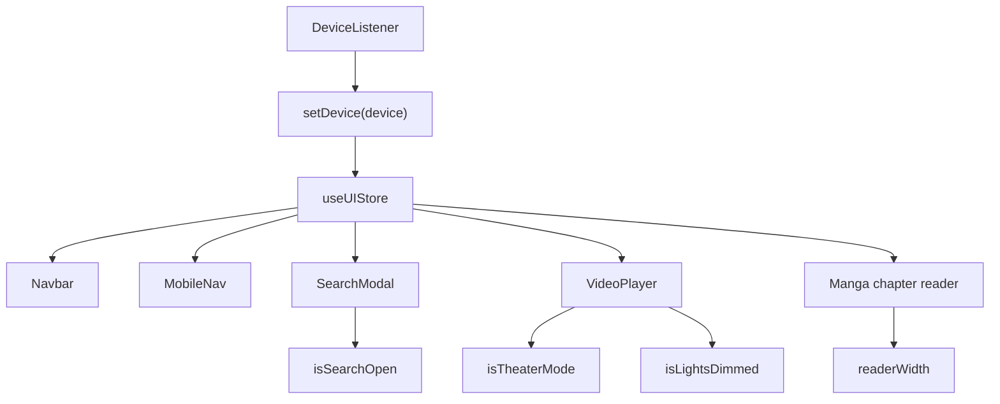

## Internal API Routes

Internal routes live under `src/app/api/*`.

### Current Route Groups

- `app/api/anichin/*`
- `app/api/jikan/enrich`
- `app/api/kanata/genres`
- `app/api/kanata/movies`

### Current Role

- They act as proxy or adapter routes to upstream APIs.
- They are useful for server-side access patterns, normalization, and cacheable search responses.
- Current UI hot paths mostly flow through `src/lib/adapters/*`, not a single monolithic API helper.

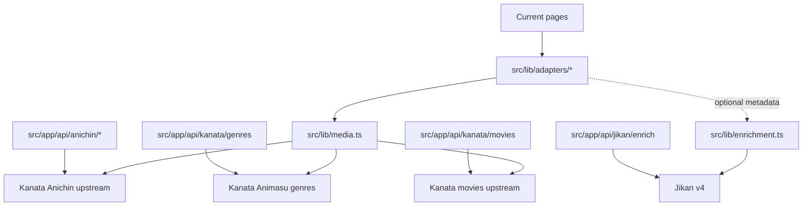

## Anime Dataflow

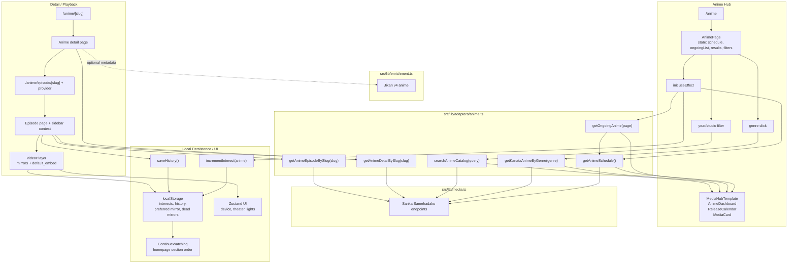

## Manga Dataflow

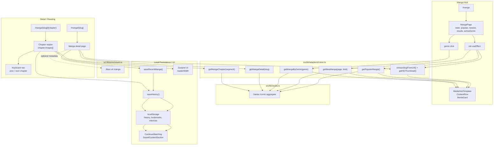

## Movie Dataflow

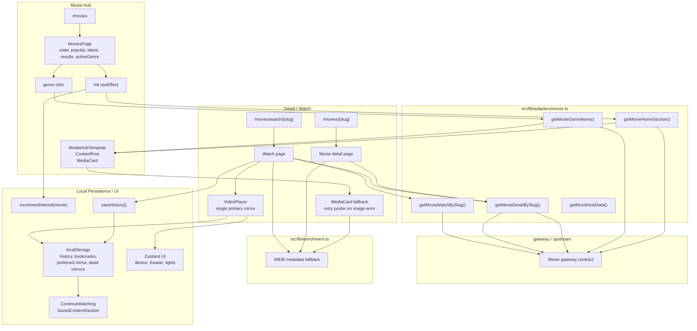

## Donghua Dataflow

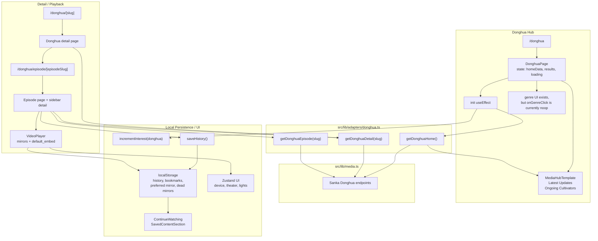

## Operational Notes

- `src/hooks/useMediaHub.ts` exists as a shared hook idea, but it is not part of the active runtime path today.
- `SearchModal` fans out through selected internal search routes.
- `src/lib/api.ts` no longer exists; shared logic is split across `media.ts`, `enrichment.ts`, and `adapters/*`.
- `app/api/*` is best understood as selective server adapters, not a monolithic app API layer.
